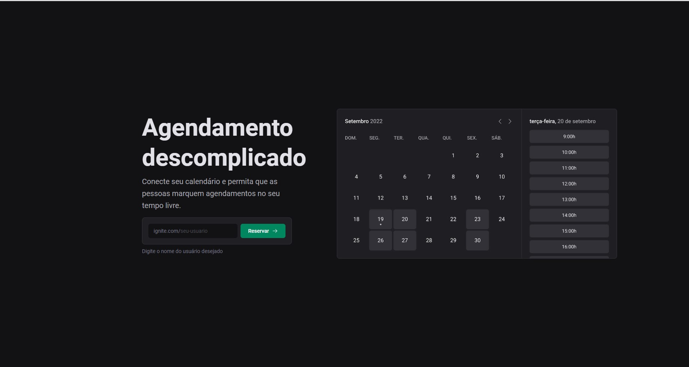

# Ignite Call - NextJS

## 📖 Sobre 

  Projeto de agendamento integrado com a Google Agenda, Utilizando Next13 e seu poderoso kit, aproveitando tanto da renderização do servidor quanto do cliente,  fazendo consultas ao banco de dados pelas rotas de backend e se autenticando com o google. Porém utilizando também no lado do cliente o ReactQuery para lidar com as diversas datas de possíveis agendamento. Grande trabalho de formatação e operações com datas utilizando a biblioteca DayJS. 
  
  Para o desenvolvimento desse projeto foi criado um Design System para facilitar na estilização, ele foi publicado no npm como @tkn-ui.

## 🚀 Tecnologias

- NextJS 13
- Google APIs
- Prisma
- Axios
- DayJS
- Nookies
- Phoshpor Icons
- NextAuth
- React Hook Form
- Zod
- React Query
- Mysql

## Configurar .env
Preencher com as seguintes variáveis

- DATABASE_URL=
- GOOGLE_CLIENT_ID=
- GOOGLE_CLIENT_SECRET=
- NEXTAUTH_SECRET=

## 📦 Como baixar o projeto

   Clonar os repositórios
   
    $ git clone https://github.com/freitasDavi/06-ignite-call
   
    # Instalar o node

    # Instalar as dependencias
  
    $ npm install
    
    # Inicializar a aplicação

    $ npm run dev

--- 

This is a [Next.js](https://nextjs.org/) project bootstrapped with [`create-next-app`](https://github.com/vercel/next.js/tree/canary/packages/create-next-app).

Open [http://localhost:3000](http://localhost:3000) with your browser to see the result.
